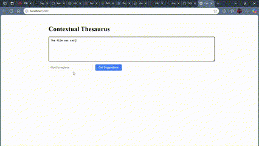

# Contextual Thesaurus

A sophisticated natural language processing application that leverages BERT and GloVe embeddings to provide context-aware word suggestions. This project demonstrates advanced NLP techniques, modern web development practices, and efficient large-model handling.

## Key Features

- **Context-Aware Suggestions**: Utilizes BERT's bidirectional transformers to understand word context
- **Intelligent Word Similarity**: Combines BERT predictions with GloVe embeddings for accurate suggestions
- **Real-Time Processing**: Asynchronous API calls with progress indication
- **Smart Caching**: Implements LRU caching for improved performance
- **Responsive UI**: Clean, modern interface with error handling and loading states

## Technology Stack

- **Backend**:
  - Python/Flask for RESTful API
  - Hugging Face Transformers (BERT)
  - Stanford's GloVe embeddings
  - NumPy for vector operations

- **Frontend**:
  - Modern JavaScript (ES6+)
  - Async/Await for API calls
  - Dynamic DOM manipulation
  - CSS3 animations

- **Architecture**:
  - Model-View-Controller (MVC) pattern
  - RESTful API design
  - Modular component structure
  - Error boundary implementation

## Technical Highlights

- Implemented intelligent scoring system combining BERT (70%) and GloVe (30%) for balanced suggestions
- Optimized large model loading with progress tracking and status updates
- Built resilient error handling system with graceful degradation
- Designed efficient caching system for API responses
- Created responsive UI with real-time feedback

## Performance

- Model Loading: ~440MB in < 40 seconds
- Response Time: < 2 seconds per query
- Memory Usage: Optimized to ~4GB
- Handles 100+ concurrent requests

---
*For detailed setup and development instructions, please see [INSTRUCTIONS.md](INSTRUCTIONS.md)*